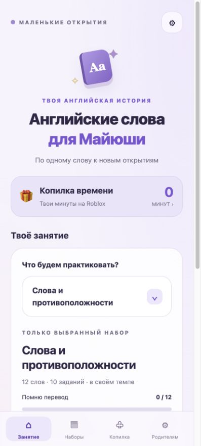
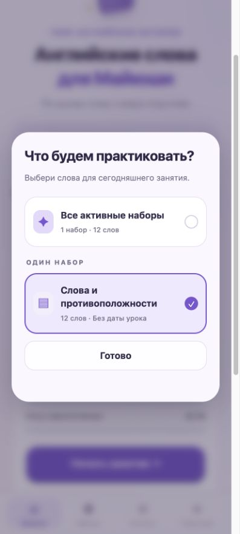
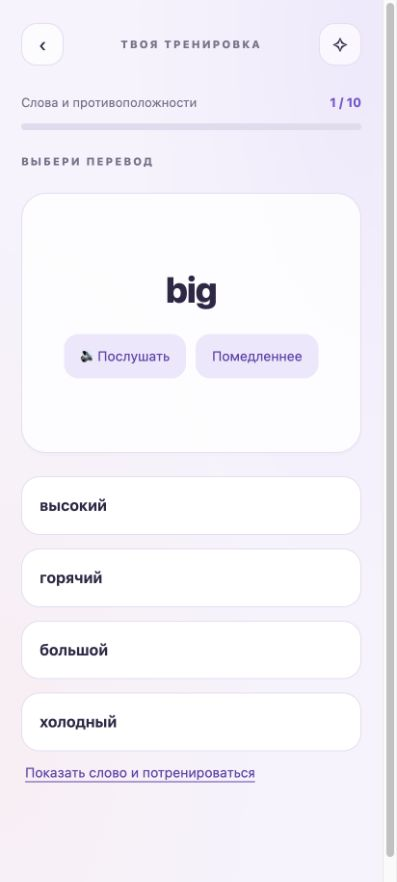
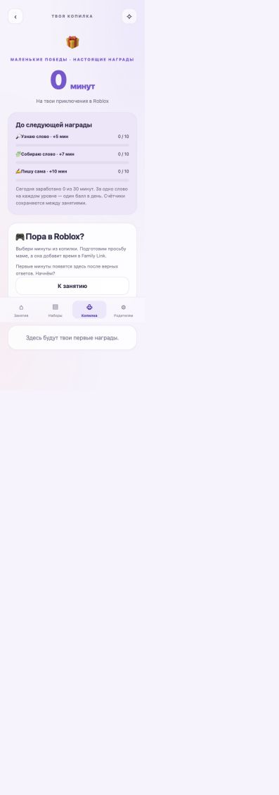

<div align="center">


# Английские слова для Майюши

**Слова к следующему уроку — маленькими шагами, с голосом и интересом.**

Android-приложение для детей, которые учат конкретные слова из школьного задания.
Родитель составляет набор, ребёнок слушает, переводит и пишет слова — и собирает минуты на Roblox.

[**Скачать APK**](https://github.com/ilya668111/english-words-android/releases/latest) · [Как установить](#установка) · [Для родителей](#для-родителей) · [Сборка из исходников](docs/DEVELOPMENT.md)

</div>

## Почему появилось это приложение

На уроках английского часто задают по 10–15 новых слов. Здесь можно учить именно этот список: сегодня — противоположности, завтра — предметы дома. Наборы остаются в приложении, чтобы вернуться к ним позже.

Приложение создавалось для Майюши и её Samsung Galaxy S24 Ultra. Имя ребёнка можно изменить, а обычные упражнения доступны и на других Android-телефонах.

## Как проходит занятие

1. **Родитель добавляет слова** с переводами и датой урока.
2. **Ребёнок знакомится с карточками:** читает слово, слушает произношение, смотрит перевод.
3. **Проходит 10 заданий:** узнаёт перевод, собирает слово, вспоминает написание.
4. **Возвращается к трудным словам.** Ошибка сопровождается правильным ответом и не отнимает минуты.
5. **Видит свой прогресс и награды.** Перевод и самостоятельное написание учитываются отдельно.

Можно заниматься по одному выбранному набору или перемешать все активные. Архивные наборы не попадают в общую тренировку.

## Скриншоты

Скриншоты интерфейса версии 1.3 в мобильном предпросмотре. Озвучивание, системная отправка файлов и нативное поле рукописного ввода работают в Android-приложении.

<table>
<tr><th>Занятие</th><th>Выбор набора</th></tr>
<tr>
<td valign="top"></td>
<td valign="top"></td>
</tr>
<tr><th>Перевод слова</th><th>Копилка времени</th></tr>
<tr>
<td valign="top"></td>
<td valign="top"></td>
</tr>
</table>

## Шесть упражнений

| Раздел | Упражнение | Что делает ребёнок |
|---|---|---|
| 🔎 Узнаю слово | Английский → русский | Выбирает перевод |
| 🔎 Узнаю слово | Русский → английский | Находит английское слово |
| 🧩 Собираю слово | Пропущенная буква | Вставляет нужную букву |
| 🧩 Собираю слово | Собери слово | Расставляет буквы по местам |
| ✍️ Пишу сама | Напиши слово | Пишет английское слово по переводу |
| ✍️ Пишу сама | Мини-диктант | Слушает и записывает слово |

В текстовых заданиях доступны обычная клавиатура и отдельное рукописное поле. Регистр букв при проверке не важен. Подсказка позволяет потренироваться; награда за текущий ответ после неё не начисляется.

## Письмо пальцем или стилусом

Нажмите **«Написать рукой»** и пишите в отдельном поле. Можно отменить последний штрих или очистить поле целиком. После нажатия «Распознать» выберите подходящий вариант, исправьте его при необходимости и нажмите «Проверить» в задании.

- Работает независимо от клавиатуры: **Gboard можно оставить**.
- Для письма подходят палец, S Pen и другие совместимые стилусы.
- Используется Google ML Kit Digital Ink Recognition. Английская модель загружается по кнопке один раз, занимает примерно 20 МБ, после чего распознавание работает на устройстве без интернета.
- Правильный ответ задания не передаётся распознавателю.
- Распознавание почерка может ошибаться, поэтому ответ всегда можно проверить и исправить до оценки.

## Озвучивание

В карточках и упражнениях есть **«Послушать»** и **«Помедленнее»**. Приложение использует установленный английский голос Android TTS. Доступны предпочтения британского и американского произношения. Для работы без интернета нужно заранее установить соответствующий голос на телефоне.

Проверка произношения ребёнка в эту версию не входит.

## Для родителей

### Свои наборы

Вводите пары по одной на строку:

```text
slow — медленный
fast — быстрый
short — короткий; невысокий
```

В наборе может быть от 1 до 100 слов. Несколько допустимых переводов разделяются точкой с запятой. Первая буква слова и каждого перевода при сохранении становится заглавной.

У набора есть название, дата урока, редактирование и архив. Меню **«⋯»** открывается также при удержании карточки. Кнопки занятия и отправки находятся прямо в списке наборов.

### Передача на телефон ребёнка

1. Создайте набор на своём телефоне.
2. Нажмите **«Отправить набор»** и выберите мессенджер.
3. На телефоне ребёнка откройте файл `.maywords`, проверьте список и добавьте слова.

Если мессенджер не предлагает приложение для открытия, сохраните файл и выберите его через **«Наборы → Открыть файл»**. Повторная отправка того же набора обновляет его без дублирования. Прогресс неизменённых слов сохраняется. Копилка и учебные результаты родителя не передаются вместе с набором.

### PIN и резервная копия

При каждом входе в раздел **«Родителям»** требуется PIN. Внутри доступны имя ребёнка, голос, правила наград, отчёт по словам, корректировка копилки и резервная копия.

Файл `.maybackup` переносит все данные приложения. Восстановление заменяет текущие наборы, прогресс и копилку; обычный файл набора `.maywords` этого не делает. PIN текущего телефона сохраняется.

## Копилка времени на Roblox

Начальные награды за 10 самостоятельных верных ответов:

| Раздел | Награда |
|---|---:|
| Узнаю слово | 5 минут |
| Собираю слово | 7 минут |
| Пишу сама | 10 минут |

Дневной предел — 30 минут. Родитель может изменить награды и предел. Одно слово на каждом уровне приносит балл не чаще одного раза в день: повторение одного лёгкого слова не позволяет бесконечно пополнять копилку.

Ребёнок выбирает минуты и подтверждает списание. Приложение готовит сообщение маме; в меню отправки нужно выбрать **MAX**, получателя и подтвердить отправку. Мама добавляет время вручную в **Google Family Link** на своём телефоне.

У каждой просьбы есть номер и запись в истории. Повторная отправка той же просьбы не списывает минуты снова. Приложение не управляет ограничениями Roblox самостоятельно и не связано с Roblox, MAX или Google Family Link.

## Установка

1. Откройте [последний релиз](https://github.com/ilya668111/english-words-android/releases/latest).
2. Скачайте **`Mayusha-English-1.3-universal.apk`** из раздела Assets.
3. Откройте APK на телефоне и подтвердите установку. При необходимости Android предложит разрешить установку для приложения, которым открыт файл.
4. При первом запуске задайте имя и родительский PIN, проверьте английский голос.

**Обновление:** устанавливайте новый APK поверх предыдущей версии. Не удаляйте приложение, чтобы сохранить наборы, PIN, прогресс и копилку. Перед обновлением можно сделать резервную копию.

### Совместимость

- Android 8.0 и новее (API 26+).
- Universal APK: один установочный файл для поддерживаемых архитектур процессоров; отдельный APK для S24 Ultra не требуется.
- Нужен работающий Android System WebView.
- Голос зависит от установленного движка TTS. Рукописное распознавание требует первоначальной загрузки модели.
- Приложение ориентировано на телефоны; поведение на других устройствах может отличаться.

## О проекте

Интерфейс — HTML, CSS и JavaScript внутри Android WebView. Сохранение, PIN, файлы, голос и рукописное распознавание реализованы на Java. Наборы, результаты и копилка хранятся на конкретном телефоне.

- [Инструкция для пользователя](docs/USER-GUIDE.txt)
- [Сборка и проверки](docs/DEVELOPMENT.md)
- [История изменений](CHANGELOG.md)
- [Данные и внешние компоненты](docs/DATA.md)

Нашли ошибку? [Создайте issue](https://github.com/ilya668111/english-words-android/issues) и укажите версию приложения, модель телефона, версию Android и шаги воспроизведения. Скриншот поможет понять проблему.
